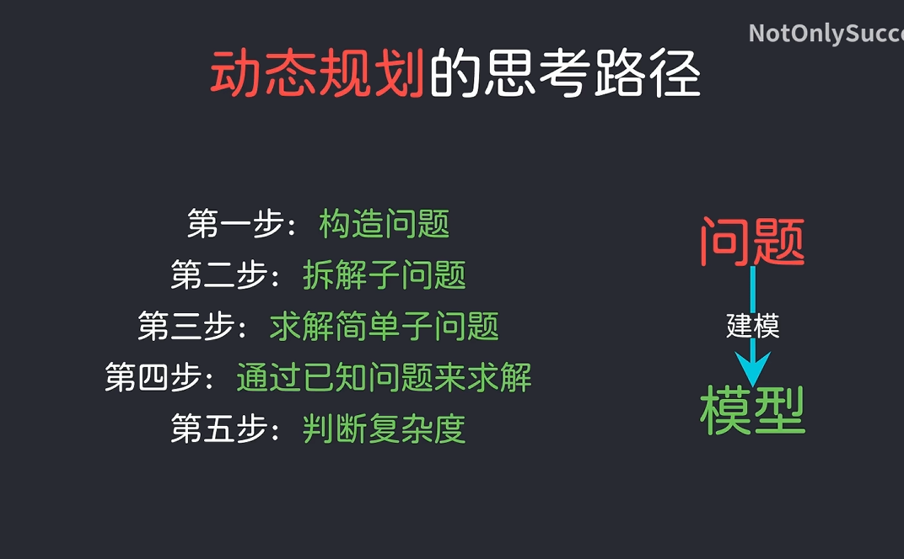

# [视频引子](https://www.bilibili.com/video/av1256092958/)
这个视频还挺有意思，很简短的介绍了一个动归的问题

然后总结出了下面的常见的流程思路



## 启发
很有意思的一点是人家的解题过程，一开始将问题转换成一个函数的时候确实很惊艳，我们给定了输入，要求相应的输出，剩下的是如何实现中间的黑盒子（虽然看上去像是废话，但是非常好的做出了第一步）

```py
 class something(input a ,input b)->some answer
```

然后是实现中间的问题，很直观的就能将两个无关的事情相联立起来，然后一步一步地反推整个过程

有一件事很有意思，作者一开始想到的是：**能不能把任务简化一点，字符短一点会怎样**

所以这个动归的思想，就很类似于高中做题时的放缩，算是某种极限的思想

最后引出，解题其实就是建模，解决某种针对性的问题，可以多看看这个很短的视频，有点水平的。