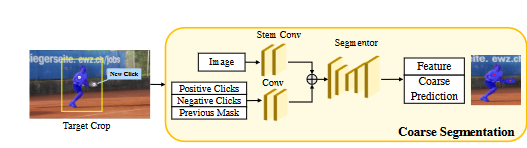

# 交互式分割流程

## 交互式分割流程简述

交互式分割是一种通过用户与计算机的交互，实现对图像中特定目标的精确分割的技术。其核心思想是：用户提供少量标注信息，计算机根据这些信息和图像的特征，自动完成分割。

**一般流程如下：**

1. **用户标注：**
   * 用户通过点击、画线、画框等方式，在图像上标注出感兴趣的目标区域或背景区域。这些标注点或区域通常被称为“种子点”或“scribbles”。
   * 标注可以是前景（目标）的标注，也可以是背景的标注，甚至是两者兼有。

2. **初始分割：**
   * 计算机根据用户提供的标注信息，结合图像的纹理、颜色、边缘等特征，生成一个初始的分割结果。
   * 这个初始分割结果可能并不完美，但为后续的优化提供了基础。

3. **迭代优化：**
   * 用户对初始分割结果进行评估，如果存在错误或不满意的地方，可以进行进一步的标注。
   * 计算机根据新的标注信息，对分割结果进行更新和优化。
   * 这个过程可以反复迭代，直到用户对分割结果满意为止。

**核心技术：**

* **图割算法（Graph Cut）：** 将图像分割问题转化为图割问题，通过最小化能量函数来获得最优分割。
* **随机游走算法（Random Walk）：** 将图像中的每个像素看作是一个节点，通过计算像素之间的相似性来建立图，然后通过随机游走的方式来传播标注信息。
* **深度学习：** 利用深度学习模型，尤其是全卷积神经网络（FCN），来学习图像的特征，并生成像素级别的分割结果。

**优点：**

* **精确度高：** 通过用户的交互，可以得到非常精确的分割结果。
* **灵活度高：** 用户可以根据不同的需求，灵活地调整分割结果。
* **适应性强：** 可以应用于各种类型的图像，包括自然图像、医学图像等。

**应用场景：**

* **图像编辑：** 图像抠图、图像合成等。
* **医学图像分析：** 肿瘤分割、器官分割等。
* **视频分析：** 视频目标跟踪、视频分割等。

## 图像分割算法原理及对比

图像分割是将图像分成若干个具有相似特征的非重叠区域的过程，是图像理解和计算机视觉的基础。不同的分割算法有着各自的原理和特点，下面我们来详细探讨一下。

### 1. 基于阈值的分割

**原理：**
* 根据图像的灰度值设置一个或多个阈值，将像素分为不同的区域。
* 常用的阈值选择方法有：全局阈值、局部阈值、自适应阈值等。

**优点：**
* 简单、快速。
* 对噪声不敏感。

**缺点：**
* 对复杂图像效果不佳。
* 阈值选择较为困难。

### 2. 基于边缘的分割

**原理：**
* 检测图像中的边缘，将边缘作为不同区域的边界。
* 常用的边缘检测算子有：Sobel算子、Canny算子等。

**优点：**
* 能准确地检测出物体的边缘。

**缺点：**
* 对噪声敏感。
* 无法处理弱边缘或没有明显边缘的区域。

### 3. 基于区域的分割

**原理：**
* 将图像中的像素按照相似性准则合并成区域。
* 常用的方法有：区域生长、区域分裂合并等。

**优点：**
* 能较好地保持区域的完整性。

**缺点：**
* 对初始区域的选取敏感。
* 计算复杂度较高。

### 4. 基于聚类的分割

**原理：**
* 将图像中的像素视为数据点，利用聚类算法将像素分为不同的簇。
* 常用的聚类算法有：K-means、模糊C-means等。

**优点：**
* 能自动发现图像中的不同区域。

**缺点：**
* 对聚类中心的初始化敏感。
* 计算复杂度较高。

### 5. 基于图论的分割

**原理：**
* 将图像视为一个图，像素为节点，像素之间的相似性为边的权重。
* 通过最小割、最大流等图论算法分割图像。

**优点：**
* 能处理复杂的图像分割问题。

**缺点：**
* 计算复杂度较高。

### 6. 基于深度学习的分割

**原理：**
* 利用深度神经网络，尤其是卷积神经网络，对图像进行像素级别的分类。
* 常用的网络有：FCN、U-Net、DeepLab等。

**优点：**
* 能准确地分割出复杂场景中的目标。
* 能端到端地进行训练和预测。

**缺点：
* 需要大量的标注数据。
* 计算资源消耗较大。

### 各种算法对比

| 算法类型 | 优点 | 缺点 | 适用场景 |
|---|---|---|---|
| 基于阈值 | 简单快速 | 对复杂图像效果不佳 | 简单图像分割 |
| 基于边缘 | 准确检测边缘 | 对噪声敏感 | 边缘明显的图像分割 |
| 基于区域 | 保持区域完整性 | 对初始区域敏感 | 纹理均匀的图像分割 |
| 基于聚类 | 自动发现区域 | 对聚类中心敏感 | 无明显特征的图像分割 |
| 基于图论 | 处理复杂问题 | 计算复杂度高 | 形状复杂的目标分割 |
| 基于深度学习 | 准确率高 | 需要大量数据 | 复杂场景下的语义分割 |

### 总结

每种分割算法都有其优缺点和适用场景，选择合适的算法需要根据图像的特征和分割任务的要求。在实际应用中，往往需要结合多种算法，才能获得更好的分割效果。

**深度学习**是目前图像分割领域的研究热点，其强大的特征提取能力和端到端的训练方式，使得分割效果有了显著提升。然而，传统的分割算法在某些特定场景下仍然具有优势。

**影响分割效果的因素：**

* **噪声：** 噪声会干扰图像的特征，影响分割结果。
* **图像复杂度：** 图像的纹理、颜色、形状等特征的复杂程度会影响分割的难度。
* **目标的尺度变化：** 目标的大小变化会对分割算法造成挑战。
* **遮挡：** 目标之间的遮挡会增加分割的难度。

**未来发展趋势：**

* **结合多模态信息：** 利用深度学习结合多模态信息（如深度、光流等）进行分割。
* **自监督学习：** 减少对大量标注数据的依赖。
* **实时分割：** 满足实时应用的需求。

---
GPT环节结束

---
# 想想该咋◯

## 为啥要交互式分割

### 可以减轻训练要求 
可以不用做前期的训练，不需要专门去做相应的适配

### 做出来的结果可以反哺
结果可以反哺回自动识别，目的肯定是能够自动的识别出结果
但是现在条件达不到，所以交互式的识别不失为一个手段

## 结果能干啥

### 三维重建
重建出胆胰管的形状，可以针对性的给手术作为参考

### 反哺训练
这算是强化学习？但是思路是想着按照之前SAM那样子，中期是建立了一个交互式的分割框架能够更好的为后续进行分割

后续结合人工和机器标注的来扩充数据集进行训练

# 所以点下去会发生啥
首先是一张存在目标的图片

然后你点击下去会生成一个新的掩模图片，里面包含0、1、2，分别代表：空白、positive、negative

之后是一个网络，用来将点击生成的掩模和原始图片相结合

再送入到一个新的用于分割的网络，生成出相应的Mask

用户对新的Mask做以修改

